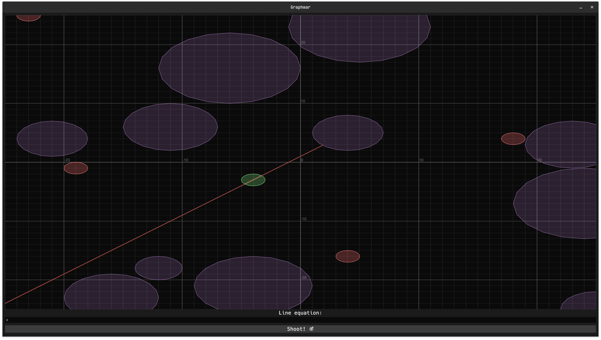

# GRAPHWAR::RUST 🦀

Rust version of the plot game [graphwar](http://www.graphwar.com/)



## Purpose & Origins

Originally, I made this because I wanted to play the game but didn't want to install the "JVM" on my machine (original graphwar is done in java) _(because I kinda hate java, and oracle policy -\_\_- ~~)_

It is fast, performant, and secure (well I done it in rust, what did you expect me to say?)

Purpose:

- **Have fun**
- Improve my rust skills
- Learn how to make rust desktop app

Not a purpose:

- Being a replacement to the awesome [original game](http://www.graphwar.com/) (seriously it's just a side project, see next section)

## Limitations

This project is **not** a replacement for the [original game](http://www.graphwar.com/), it's just a side project that I found funny.

Indeed, I kinda drop this project? Like I implemented all the features that I originally wanted to implement, which is far behind all the features that offer the [original game](http://www.graphwar.com/), this games lacks multiplayer, angle shoot, ODE's and so much more (this is because I don't want to take this project too seriously). I also never played the [original game](http://www.graphwar.com/), so I kinda did what I wanted to do (artistic freedom), whether the [original game](http://www.graphwar.com/) did it the same way or not.

# Made With

1. **Elegance** ✅
2. `RUST` ⭐🦀
3. [`egui`](https://www.egui.rs/) (to make desktop application + Plotter) ♥

## improvement roadmap

- implement ODE's with numerical methods
- try to match more the [original game](http://www.graphwar.com/) (maybe by playing it?)
- if and only if one day I take this project seriously, implement the multiplayer thingy~

## Installation

Build from source with `cargo`, or download the **linux** executable from the `release page`

```bash
cargo build --release # will creates a single executable for your os in ./target/release/graphwar
```
